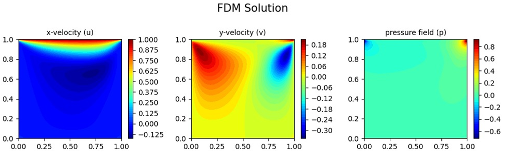
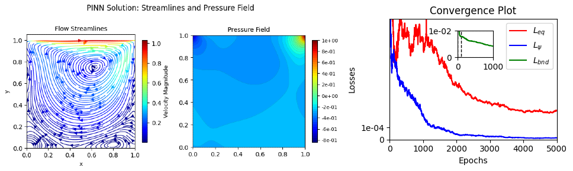
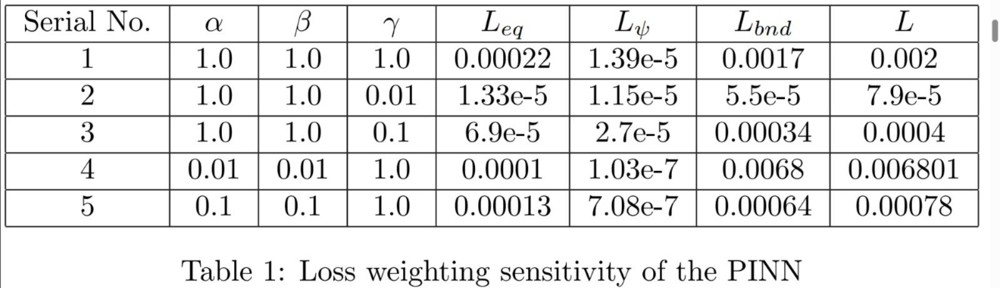

# Application-of-Machine-Learning-in-Solving-Dynamic-Flow-problems
The work involved building and investigation of a Physics Involved Neural Network (PINN) to address a classic benchmark problem in computational fluid dynamics (CFD). The impact of the weights of the different components of loss functions is analyzed and their streamlines, pressure fields and convergence plots and accuracies are obtained.

# Results Obtained

